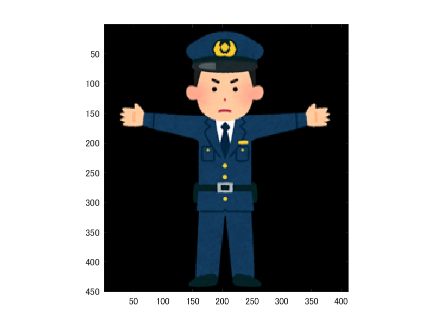
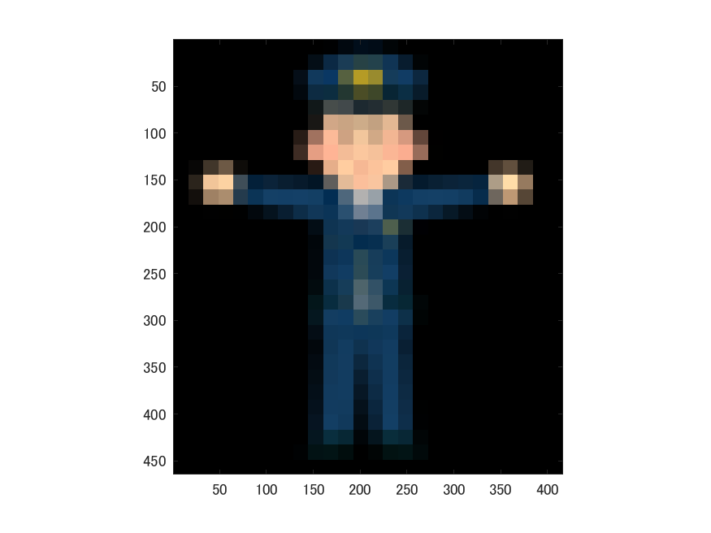

# 課題1レポート

標準画像を「police.png」を原画像とする。

`ORG=imread('police.png'); % 原画像の入力`  
`imagesc(ORG); axis image; % 画像の表示`

によって、原画像を読み込み、表示した結果を図1に示す。

図1　原画像

原画像を1/2サンプリングするには、画像を1/2倍に縮小し、2倍に拡大する。拡大する際には，単純補間するために「box」オプションを設定する。

`IMG = imresize(ORG,0.5); % 画像の縮小`  
`IMG2 = imresize(IMG,2,'box'); % 画像の拡大`  
`imagesc(IMG2); axis image; % 画像の表示`

図2　1/2サンプリング

原画像を1/4サンプリングするには、画像を1/2倍に縮小し、4倍に拡大する。拡大する際には，単純補間するために「box」オプションを設定する。  
`IMG = imresize(IMG,0.5); % 画像の縮小`  
`IMG2 = imresize(IMG,4,'box'); % 画像の拡大`  
`imagesc(IMG2); axis image; % 画像の表示`  

図3 1/4サンプリング  

次に1/8サンプリングをする。  
`IMG = imresize(IMG,0.5); % 画像の縮小`  
`IMG2 = imresize(IMG,8,'box'); % 画像の拡大`  
`imagesc(IMG2); axis image; % 画像の表示`  
  
図4 1/8サンプリング

次に1/16サンプリングをする。  
`IMG = imresize(IMG,0.5); % 画像の縮小`    
`IMG2 = imresize(IMG,16,'box'); % 画像の拡大`     
`imagesc(IMG2); axis image; % 画像の表示`  
    
図5 1/16サンプリング

次に1/32サンプリングをする。  
`IMG = imresize(IMG,0.5); % 画像の縮小`  
`IMG2 = imresize(IMG,32,'box'); % 画像の拡大`    
`imagesc(IMG2); axis image; % 画像の表示`
  
図6 1/32サンプリング
